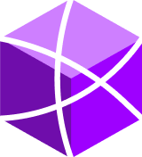
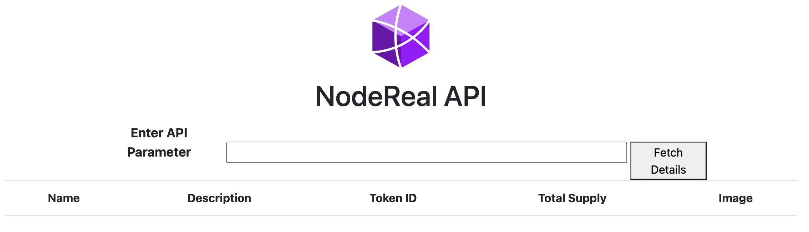
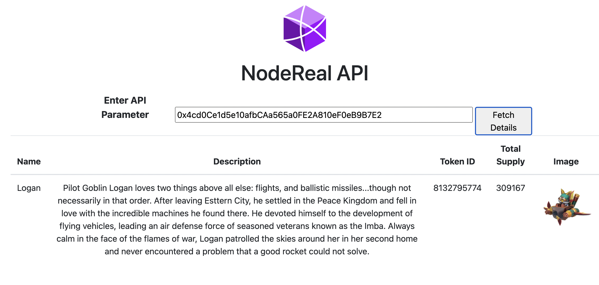

# Exploring the NodeReal Enhanced API (Part 2) -- NFT APIs

NFT is super popular for the web3 development. NFTs have been used to exchange digital tokens that link to a digital file asset. Ownership of an NFT is often associated with a license to use such a linked digital asset. Some agreements only grant a license for personal, non-commercial use, while other licenses also allow commercial use of the underlying digital asset.

## Non-Fungible Token and Simi-Fungible Token

Specific token standards support various blockchain use-cases. Ethereum was the first blockchain to support NFTs with its ERC-721 standard and this is currently the most widely used. Many other blockchains have added or plan to add support for NFTs.

ERC-721 was the first standard for representing non-fungible digital assets on the Ethereum blockchain. ERC-721 is an inheritable Solidity smart contract standard; ERC-721 provides core methods that allow tracking the owner of a unique identifier, as well as a permissioned way or the owner to transfer the asset to others.

The ERC-1155 standard offers "semi-fungibility", as well as providing an analogue to ERC-721 functionality (meaning that an ERC-721 asset can be built using ERC-1155). Unlike ERC-721 where a unique ID represents a single asset, the unique ID of an ERC-1155 token represents a class of assets, and there is an additional quantity field to represent the amount of the class that a particular wallet has. Assets of the same class are interchangeable, and a user can transfer any amount of assets to others.

## Heros&Empires NFT  

In our tutorial, we will use NodeReal enhanced api to query an existing non-fungible token, Heros&Empires NFT, so that we do not need query the corresponding information with raw API which is complex to use for the NFT senarios.

Heroes & Empires has exquisitely digital collectibles created using blockchain technology. Heroes & Empires Universe has a lot of different races like Human, Goblin, Elf, Demon, Beast, Naga, God and Undead which are waiting for the user to discover and collect.


## Start Coding

The smart contract of the NFT collection is *0x4cd0Ce1d5e10afbCAa565a0FE2A810eF0eB9B7E2*, and if you are interested in the collections, you can visit [heros&empires](https://heroesempires.com/).

1. we want to know the metadata of the NFTs 

   For each NFT collections, we can query the basic information of the NFTs, like the name, url of image, and other properties.

2. we want to know the total supply of the NFTs

   In this senario, we will use the API of "nr_getTotalSupply721" to query the total supply of the NFT contract. 

To achieve the goals mentioned above, we need to clone the sample code from [git](https://github.com/node-real/BNB-Chain-Tutorials.git)

```shell
git clone https://github.com/node-real/BNB-Chain-Tutorials.git
```

The NFT APIs are enhanced API provided by [Nodereal](www.nodereal.io), you can login to the nodereal with your github account. I have created a BSC RPC node already, so I will use my API endpoint for this tutorial. You need to create your own node of BSC mainnet to follow this tutorial. 

Enter the NFT721 folder, and the structure of the code is like below. 

```
cd NFT721        
NFT721 % tree
.
├── LICENSE
├── README.md
├── img
│   ├── favicon.ico
│   ├── icon-nodereal.png
│   ├── image-20220824172211685.png
│   ├── logo.png
│   ├── screenshot.png
│   ├── screenshot2.png
│   ├── screenshot3.jpeg
│   └── screenshot3.png
├── index.html
├── js
│   ├── open-rpc-client.js
│   └── web3.min.js
├── list.txt
├── package-lock.json
└── screenshot.png

```

Because all enhanced API are not compatable with the web3.js, we need use *open-rpc-client* to query the metadata of the NFTs. I have placed the client bundle under the *js* folder.

Open index.html, first we can create a table to display the basic info of the NFT 721. 

```html
<table class="table">
  <thead>
     <tr>
        <th scope="col">Name</th>
        <th scope="col">Description</th>
        <th scope="col">Token ID</th>
       	<th scope="col">Image</th>
     </tr>
  </thead>
 <tbody>
 </tbody>
 </table>
```

There are 3 columns that will display the token`s name, description and token ID. Because NFT 721 is unique, each token has its own token id. 

Next, under the script section, we can create a function to query the metadata of the token. Please note you need to replace the *{YOUR-API-KEY}* to your own api key. You can find your key under your application dashboard of nodereal.

```typescript
async function txDetails(tHash){
        var address = tHash
        const {  RequestManager, HTTPTransport, Client } = window.OpenRpcClient;
        const transport = new HTTPTransport("https://bsc-mainnet.nodereal.io/v1/{YOUR-API-KEY}");
        const client = new Client(new RequestManager([transport]));
        const result = await client.request({method: "nr_getNFTMeta", params: [address,"0x1E4C09D7E","ERC721"]});
        console.log(result.meta);
        const meta = JSON.parse(result.meta)
        const image = meta.image
        $('tbody').append("<tr><td>" + meta.name + "</td><td>" + meta.description + "</td><td>" + meta.tokenId);
        $('tbody').append("');
      }
```

In this function, we can call the method of *nr_getNFTMeta*, it is a function that returns the metadata of NFT tokens. 

```json
Request Body:
List [ "0xEA5613EBBBE1E69BF5F05252C215462254F41565", "0x7C7", "ERC721" ]

Example
contractAddress: [string] address of NFT contract
tokenId: [string] hex encoded token id
tokenType : [string] (optional) "ERC721" or "ERC1155"; specifies type of token to query for
string]
```

In our case, we trasfer the address of the NFT 721, and token id of "0x1E4C09D7E", which is a NFT token from *heros&empires*. 

Next, we want to query the total supply of this NFT by the NFT contract. Therefore, we add a new column for the total supply data. 

```
<th scope="col">Total Supply</th>
```

And we call the *nr_getTotalSupply721* API to get the total supply of the NFT. 

```json
example: List [ "0xF24Bf668Aa087990f1d40aBAbF841456E771913c", "latest" ]
token address: address of the ERC721 token
block number: the hex encoded block number or the string 'latest' or 'earliest' on which the total supply will be checked.
```

So in the scripts, we added the call of the total supply. 

```typescript
const supply = await client.request({method: "nr_getTotalSupply721", params: [address,"latest"]});
```

And attach the total supply to the column we just defined. Please note, the total supply returned by API is in hex format, we have converted to the decimal that is easier to be read by we humans. 

```typescript
$('tbody').append("<tr><td>" + meta.name + "</td><td>" + meta.description + "</td><td>" + meta.tokenId + "</td><td>" + parseInt(supply, 16) + "</td><td>" + "');
```

Let`s see how the code looks like now.

```html
<!DOCTYPE html>
<html lang="en">
  <head>
    <meta charset="utf-8">
    <meta http-equiv="X-UA-Compatible" content="IE=edge">
    <meta name="viewport" content="width=device-width, initial-scale=1">
    <link rel="icon" type="image/x-icon" href="/img/icon-nodereal.png">
    <title>NodeReal API Tutorial</title>
    <!-- Bootstrap -->
    <link rel="stylesheet" href="https://maxcdn.bootstrapcdn.com/bootstrap/4.0.0/css/bootstrap.min.css" integrity="sha384-Gn5384xqQ1aoWXA+058RXPxPg6fy4IWvTNh0E263XmFcJlSAwiGgFAW/dAiS6JXm" crossorigin="anonymous">
    <!-- Styles -->
    <style>
      body {
        padding-top: 15px;
      }
      h1 {
        margin: 15px 0px;
      }
    </style>
  </head>
  <body>
    <div class="container">
      <div class="row">
        <div class="col-lg-12 text-center" >
          
          <h1>NodeReal API</h1>
          <div class="container">
            <label for="thash" class="col-lg-2 control-label" style="font-weight: bold; font-size: large;">Enter API Parameter</label>
            <input id="thash" type="text" style="width: 52%;"/>
            <button id="fetch" onclick="txDetails($('#thash').val())" style="width: 10%;">Fetch Details</button>
        </div>
          <table class="table">
            <thead>
              <tr>
                <th scope="col">Name</th>
                <th scope="col">Description</th>
                <th scope="col">Token ID</th>
                <th scope="col">Total Supply</th>
                <th scope="col">Image</th>
              </tr>
            </thead>
            <tbody>
            </tbody>
          </table>
        </div>
      </div>
    </div>

    <!-- Bootstrap -->
    <script src="https://code.jquery.com/jquery-3.2.1.slim.min.js" integrity="sha384-KJ3o2DKtIkvYIK3UENzmM7KCkRr/rE9/Qpg6aAZGJwFDMVNA/GpGFF93hXpG5KkN" crossorigin="anonymous"></script>
    <script src="https://cdnjs.cloudflare.com/ajax/libs/popper.js/1.12.9/umd/popper.min.js" integrity="sha384-ApNbgh9B+Y1QKtv3Rn7W3mgPxhU9K/ScQsAP7hUibX39j7fakFPskvXusvfa0b4Q" crossorigin="anonymous"></script>
    <script src="https://maxcdn.bootstrapcdn.com/bootstrap/4.0.0/js/bootstrap.min.js" integrity="sha384-JZR6Spejh4U02d8jOt6vLEHfe/JQGiRRSQQxSfFWpi1MquVdAyjUar5+76PVCmYl" crossorigin="anonymous"></script>
    <!-- Web3 -->
    <script src="js/open-rpc-client.js"></script>
    <script>
      async function txDetails(tHash){
        var address = tHash
        const {  RequestManager, HTTPTransport, Client } = window.OpenRpcClient;
        const transport = new HTTPTransport("https://bsc-mainnet.nodereal.io/v1/{YOUR-API-KEY}");
        const client = new Client(new RequestManager([transport]));
        const result = await client.request({method: "nr_getNFTMeta", params: [address,"0x1E4C09D7E","ERC721"]});
        console.log(result.meta);
        const meta = JSON.parse(result.meta)
        const image = meta.image
        const supply = await client.request({method: "nr_getTotalSupply721", params: [address,"latest"]});
        console.log(supply)
        $('tbody').append("<tr><td>" + meta.name + "</td><td>" + meta.description + "</td><td>" + meta.tokenId + "</td><td>" + parseInt(supply, 16) + "</td><td>" + "');        
      }
    </script>
  </body>
</html>

```

Now let`s run the application on your machine. 

```shell
Starting up http-server, serving ./

http-server version: 14.1.1

http-server settings: 
CORS: disabled
Cache: 3600 seconds
Connection Timeout: 120 seconds
Directory Listings: visible
AutoIndex: visible
Serve GZIP Files: false
Serve Brotli Files: false
Default File Extension: none

Available on:
  http://127.0.0.1:8080
  http://10.151.236.108:8080
  http://10.79.132.173:8080
Hit CTRL-C to stop the server
```

Let`s open the browser and open the link of the [application](http://127.0.0.1:8080).



And then you can copy the contract of the NFT and query the details. 



All the metadata and total supply has been displayed. In the following tutorails, we will keep improving this application to make it more powerful. 


